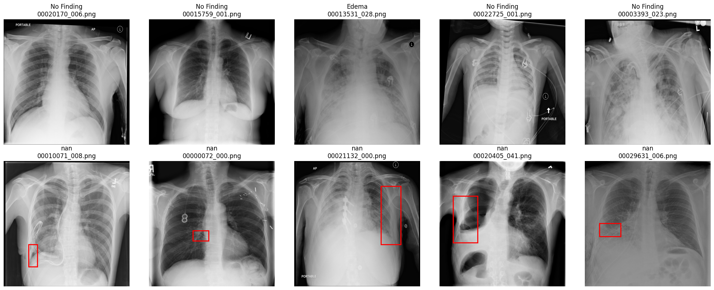
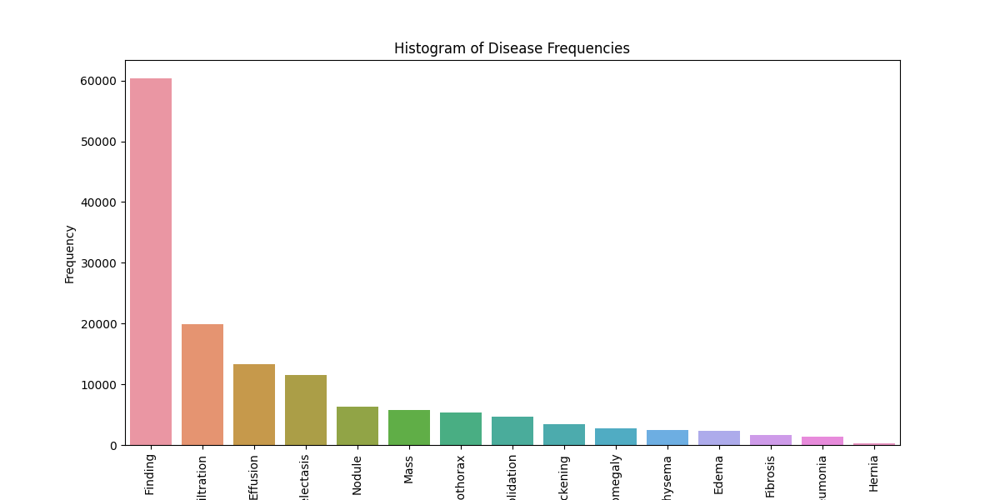
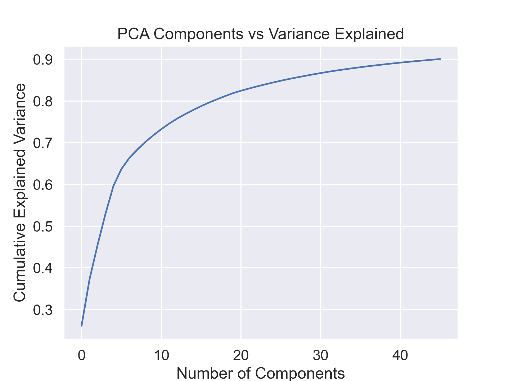
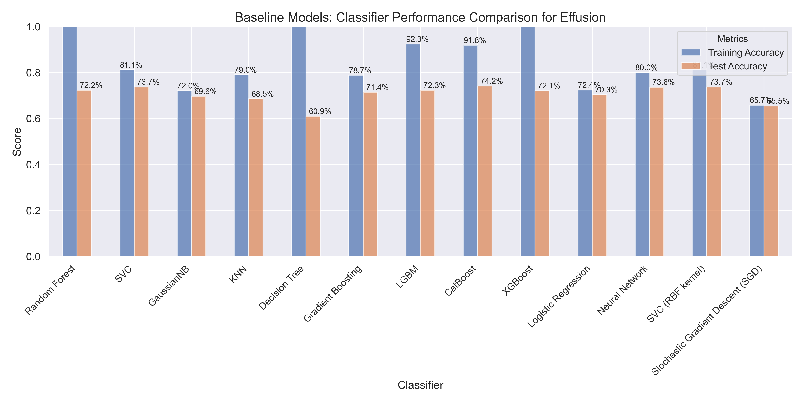
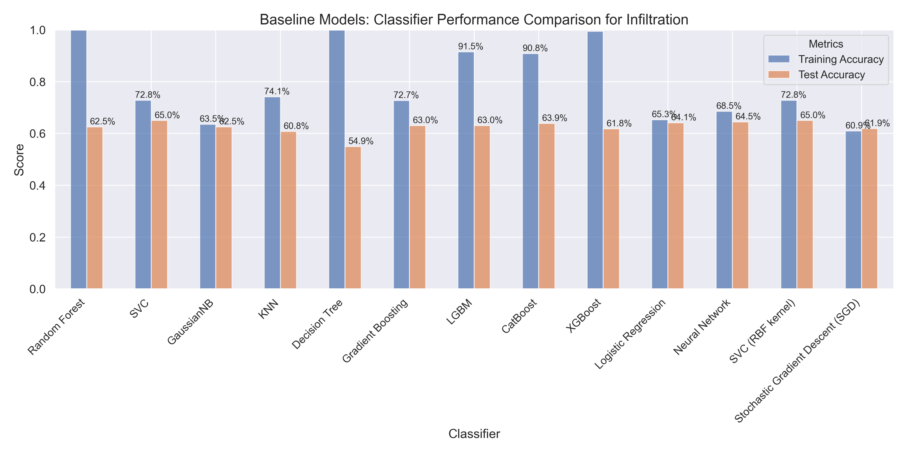
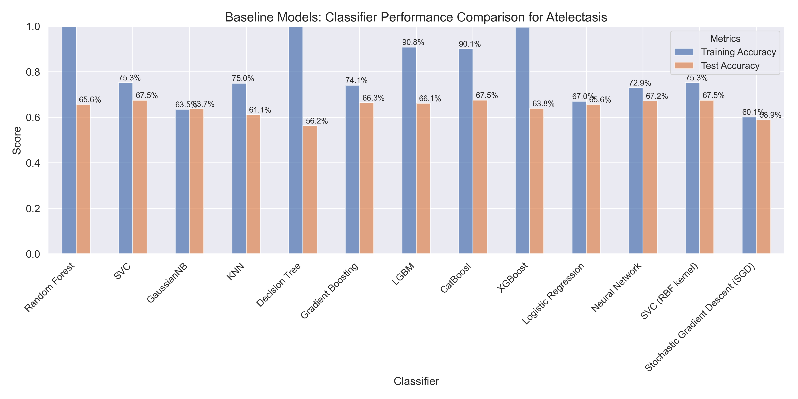

# Chest X-ray Image Classification

This repository presents a machine learning-based approach to classify diseases in chest X-ray images, with a focus on atelectasis, effusion, and infiltration. The project employs a Support Vector Machine (SVM) classifier with a Radial Basis Function (RBF) kernel (SVC) as the primary model and fine-tunes the hyperparameters for optimal performance. The methodology includes data preprocessing, feature extraction, model evaluation, and hyperparameter tuning.

## Table of Contents

1. [Data](#data)
2. [Dependencies](#dependencies)
3. [Code Structure](#code-structure)
4. [Usage](#usage)
5. [Methodology](#Methodology)
6. [Results](#results)

## Data

The dataset used in this project is the ChestX-ray dataset, which contains 108,948 frontal-view chest X-ray images of 32,717 unique patients. The dataset can be found [here](https://www.nih.gov/news-events/news-releases/nih-clinical-center-provides-one-largest-publicly-available-chest-x-ray-datasets-scientific-community).

## Dependencies

To set up the project, ensure you have the following dependencies installed:

- Python 3.x
- TensorFlow
- Keras
- scikit-learn
- NumPy
- pandas
- Matplotlib
- Seaborn

## Code Structure

The repository is organized into the following folders and files:

- `EDA`: Code for Exploratory Data Analysis (EDA) and data visualization.
- `Preprocessing and baseline models`: Code for data preprocessing, normalization, feature extraction using Principal Component Analysis (PCA), evaluation of various classifiers (e.g., SVM, Decision Trees), hyperparameter tuning, and metric calculation for the final SVC model.
- `neural_network`: Custom Convolutional Neural Network (CNN) implementation with hyperparameter tuning on a subset of data (approximately 1000 images per group).
- `app.py`: Streamlit-based user interface for end users to upload and classify images. Visit the application page [here](https://adiark-nih-chest-x-ray-image-classification-app-9g3efy.streamlit.app/).
- `requirements.txt`: Requirement files for streamlit application
- `trained_models`: Trained SVC models and PCA files for each disease.
- `data`: Image and patient information for the dataset.
- `images`: Sample images to test model implementation on the streamlit application
- `img`: Images used in the report

## Usage

1. Clone the repository to your local machine.
2. Download the ChestX-ray dataset and place it in a folder named `images` within the project directory.
3. Install the necessary dependencies.
4. Run the code for results.
5. Test the pretrained models using streamlit application [here](https://adiark-nih-chest-x-ray-image-classification-app-9g3efy.streamlit.app/) 

## Methodology

The methodology includes the following steps:

1. Exploratory Data Analysis (EDA): Analyzing the dataset, its distribution, and the relationships between the variables.
2. Data Preprocessing: Cleaning and normalizing the data, followed by feature extraction using PCA.

3. Model Evaluation: Comparing various classifiers, such as SVM and Decision Trees, to identify the best-performing model.

4. Hyperparameter Tuning: Fine-tuning the hyperparameters of the chosen SVC model to optimize its performance.
5. Result Analysis: Evaluating the model's performance based on accuracy scores and other metrics.

## Results

The final SVC model achieved classification accuracy scores of approximately 68% for infiltration, 70% for atelectasis, and 75% for effusion. The project demonstrates the potential of machine learning-based approaches to help medical professionals in identifying and diagnosing chest diseases using X-ray images.

Additionally, a custom Convolutional Neural Network (CNN) implementation is included as an alternative approach. The CNN model is trained on a subset of the dataset, with approximately 1000 images per group.

By providing an easy-to-use Streamlit application, this project enables users to test the pretrained models on their own chest X-ray images and obtain classification results for atelectasis, effusion, and infiltration. This user-friendly tool aims to increase the accessibility and applicability of the developed models to real-world scenarios.

Overall, this project highlights the importance of data preprocessing, feature extraction, and hyperparameter tuning in developing robust and accurate machine learning models for disease classification in chest X-ray images. It contributes to the growing body of research on using artificial intelligence in medical imaging and has the potential to assist medical professionals in providing better diagnosis and treatment to their patients.
